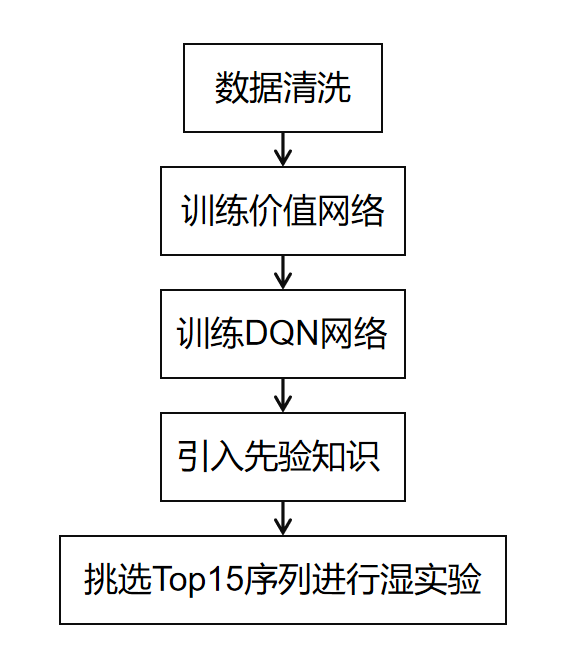

<h1 align="center">基于深度强化学习的蛋白质设计</h1>
<p align="center">
作者：周龙<br>
<a href="https://github.com/ZhouLon/SC2025">项目地址</a>
</p>


## 一、模型概述
本系统采用深度强化学习技术优化绿色荧光蛋白(avGFP)的荧光强度，通过结合**亮度预测模型(价值网络)**和**突变决策模型(DQN网络)**，实现在庞大的蛋白质序列空间（约10^308种可能）中高效搜索高荧光强度变体。系统核心思路是将蛋白质工程问题转化为序列优化问题，通过智能体与环境交互学习最优突变策略。
<p align="center">
  
  <p align="center">整体流程</p>
</p>

## 二、灵感来源
<p align="center">
  
  <p align="center">类比思路——下围棋和蛋白质突变[1]</p>
</p>

### 下围棋 vs 蛋白质设计

| 围棋                  | 蛋白质设计                              |
|---------------------|------------------------------------|
| 状态：棋盘空间（`19×19×3`）  | 状态：序列空间（`238*20，以avGFP为例`）         |
| 单次动作：在某个状态的棋盘某个位置落子 | 单次动作：在某个序列某个位置进行替换                 |
| 结果：多次落子动作后的胜负       | 结果：多次突变动作后，蛋白的实际性能变化（如酶活性、稳定性、亮度等） |
| 棋谱（历史对局）            | 已有的突变实验数据                          |

### 困难
1. **组合爆炸（突变空间太大）**
   - 围棋：19×19 棋盘约有`3^(19*19) = 10^397` 种可能棋局。
   - 蛋白质：238 个氨基酸的蛋白约有 `20^238 = 10^713` 种可能序列。

2. **“妙手”难预测（上位效应）**
   - 围棋：看似无关的两步棋组合可能绝杀（如“双劫循环”）。
   - 蛋白质：两个单独无害的突变组合可能导致蛋白失活（负上位效应）。
   
### 思路
总结下来，围棋游戏是以一系列的动作，逐渐改变棋盘空间的状态，走向终局棋面。而最终的胜负由这一系列动作决定；
而蛋白质设计也是以一系列的突变的无序集合，改变蛋白质序列状态，最终的蛋白质亮度由一系列突变决定。

基于围棋游戏与蛋白质设计高度相似,我们期望从现在围棋难题的解决思路入手，把相关思路迁移至蛋白质突变设计。
如何利用AI实现高准确度指导围棋落子，如弈者般落子，算法在361路经纬间织就胜率云图，每一步都是概率宇宙的优雅坍缩？我们瞄准了深度强化学习技术。
## 三、模型构建流程
#### 硬件：GPU为A800，80GB

### 1. 数据预处理与特征工程
- **输入数据**：四种GFP野生型序列(avGFP, amacGFP, ppluGFP, cgreGFP)和突变描述
- **数据清洗**：
  - 过滤含终止符(*)或(.)的突变
  - 去除同一位置重复突变的冗余数据(例如E21.:G21.:D21.:V21.:E21等)
- **序列编码**：
  - 统一长度238AA(后续训练只取avGFP)
  - 20维one-hot编码表示氨基酸类型
  - 238维有效位置掩码标识实际序列位置

### 2. 构建荧光强度预测模型
**功能**：作为亮度评估器，预测给定氨基酸序列的荧光强度

**设计**：
- 全连接神经网络架构
- 输入层：238×20 = 4760维特征向量
- 隐藏层：8192 → 2048 → 256维非线性变换
- 输出层：单值荧光强度预测
- 使用LayerNorm和Dropout(0.2)提升泛化能力
- 模型简单但高效，满足了后续快速探索对运算速度的需求

**训练方式**: 监督学习，使用avGFP的荧光强度数据提前进行训练，最终验证集R²=0.9434，认为其预测效果较好

**使用方式**: 后续在DQN中导入预训练好的模型


### 3. 强化学习系统核心框架
**功能**：基于当前序列，生成突变动作概率分布`(238*21)`。从动作概率分布中采样，生成突变序列。
#### 1) 双头决策网络

- **位置选择头**：预测238个潜在突变位置的概率分布
- **氨基酸选择头**：预测20种氨基酸类型+1个终止位的概率分布


#### 2) 经验回放机制
- **普通经验池**：
  - 容量：100万条经验
  - 存储格式：`[当前状态(4760), 下一状态(4760), 位置动作(1), 氨基酸动作(1), 奖励(1)]`
  
- **高价值经验池**：
  - 容量：可配置上限(`MAX_HIGH_VALUE_MEMORY`)
  - 存储条件：当预测荧光强度超过阈值(`EXPETATION`)

#### 3) 训练策略

#### ε-贪婪策略
- 初始探索率：`ε = 1.0`
- 衰减公式：`ε = max(ε × 0.999, MIN_EPSILON)`
- 动作选择逻辑：
  ```python
  # ε 的大小决定了模型是随机探索突变空间，还是基于已有经验来突变
  if 随机数 < ε:
      随机选择位置和氨基酸进行突变
  else:
      根据策略网络概率分布采样动作
  ```

#### 目标网络更新
- 策略网络：实时更新
- 目标网络：每`TARGET_NET_UPDATE`步同步一次策略网络参数


#### TD目标计算
```python
q_eval = (位置Q值 + 氨基酸Q值) / 2
q_next = (下一状态最大位置Q + 最大氨基酸Q) / 2
q_target = 奖励 + GAMMA * q_next
```

#### 损失函数
采用均方误差损失：
```python
loss = MSE(q_eval, q_target)
```

#### 4) DQN训练流程
<p align="center">
  
</p>

#### 5) 提取高价值突变回放池
1. 从高价值经验池提取突变序列
2. 与野生型序列比对，识别突变位点
3. 过滤已存在于排除列表的序列


#### 6) 选择top15序列进行湿实验
- 成功构建12条序列，进行亮度测试和热稳定性测试。其中11条均比WT亮度高，1条比WT差
- 最终提交热稳定性实验后排序较高的六条序列

## 注意事项
- 本项目采取GNU GPLv3 License
- 若有学术交流意愿，请联系作者：1922450589@qq.com

## 鸣谢
### [本研究工作得到了华南理工大学科学计算公共服务平台的支持](https://hpc.scut.edu.cn/)
### 感谢杨晓锋老师对本研究工作的支持


## 参考
<p>[1]https://baijiahao.baidu.com/s?id=1772019024557144441&wfr=spider&for=pc</p>
<p>[2]Silver, D., Huang, A., Maddison, C. et al. Mastering the game of Go with deep neural networks and tree search. Nature 529, 484–489 (2016).</p>
